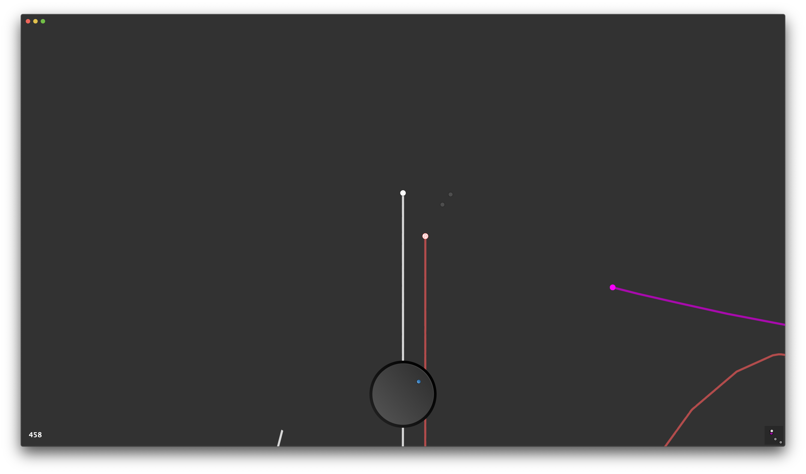

<!doctype html>
<html>
  <head>
    <title>Breaking</title>
    <meta charset="utf-8">
    <meta http-equiv="X-UA-Compatible" content="chrome=1">
    <meta name="description" content="World News"/>
    <meta name="keywords" content="mac, ios, app, store, apple, download, news, world, local, international, today, now, breaking, latest"/>
    <link rel="stylesheet" href="styles.css">
    <meta name="viewport" content="width=device-width">
    <!--[if lt IE 9]>
    
    <![endif]-->
  </head>
  <body>
    

    <header>
        <h1>Breaking</h1>
         
        
           
        
         
         
        <a href="https://apps.apple.com/us/app/breaking-world-news/id1503979080?ls=1" title="Download on the iOS App Store">
            <b>iOS</b>
        </a>
         
         
        <a href="https://apps.apple.com/de/app/breaking/id1502898047?l=en&mt=12" title="Download on the macOS App Store">
            <b>macOS</b>
        </a>
         
         
        <a href="mailto:breaking@iturbi.de" title="Contact Us">
            <b>Contact Us</b>
        </a>
    </header>
    <section>
        
            
        <h2>Overview</h2>
        
World news from different providers.

        
Get the most relevant world news right into this app and choose to continue reading or not.

        
No ads and no popups in the app.

        
RSS news feed from:

        <ul>
        <li>The Guardian</li>
        <li>The Local</li>
        <li>Der Spiegel</li>
        </ul>
          
        
        <h2>Privacy</h2>
        
<b>Breaking</b> does NOT track your activity in any way, not Analytics nor any other event or behaviour metrics. Whatever you do with this app is up to you and we don't want to know about it.

         
    </section>
    

    
  </body>
</html>
